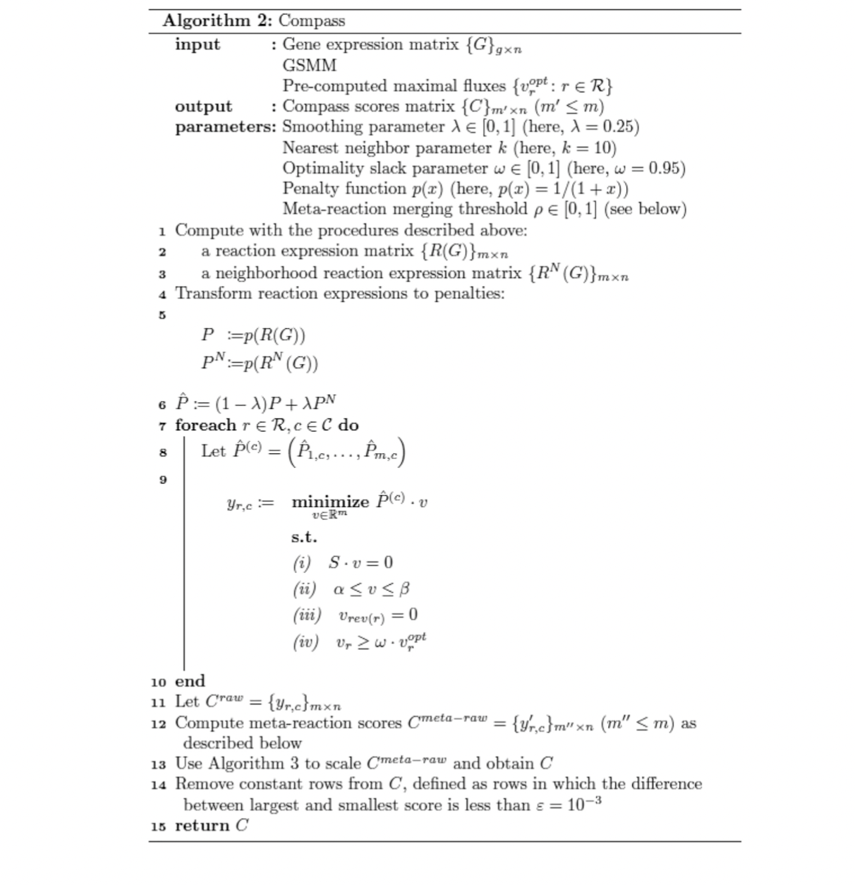

```{r setup, include=FALSE}
source("../lib/utility.R")
source("../lib/my_compassR/my_compass.R")
source("../lib/fast_mixomics.R")
source("../lib/compareClusters.R")
source("../lib/plotMixOmics.R")
```

# Context

*Experimental Autoimmune Encephalomyelitis* (EAE) is the mouse model of multiple sclerosis. We want to compare the leukocytes that are in the spinal
cord in the diseased toward its control in the two stages of disease that are onset, when the first visible clinical signs appear, and chronic that is
when the disease starts to have chronic clinical progression. Here controls are not healthy mice, as they were injected with a mixture that recreates
inflammation that is not disease specific.

The assumption is that these diseases are influenced, if not induced, by precisely this migration of leukocytes from the blood into central nervous
tissue. The results of the single-cell RNA-sequencing (scRNA-seq) were analysed exploiting a workflow of
[**singleCellExperiment**](https://bioconductor.org/books/release/OSCA/). And during the process also the cell types were determined.

# Data extraction

```{r eval=FALSE}
# library(scuttle)
# # path of sce data
# sce_data_path <- "../../data/eae/sce_cd4_EAE.Rds"
# # load data
# sce <- readRDS(sce_data_path)
# assay(sce, "tpm") <- calculateTPM(sce)
# # retrieve all metadata
# metaDataColumns <- c("pruned_fine", "stage", "ident", "nCount_RNA", "nFeature_RNA", "total","detected", "subsets_Mito_sum", "subsets_Mito_detected", "subsets_Mito_percent", "sizeFactor")
# 
# # save tpm counts
# tpm_outputs <- get_tpm_counts(sce = sce, colnames_metadata = metaDataColumns)
# writeCompassInput(sample = tpm_outputs, countType = "tpm", output_dir = "../../data/eae/tpm_counts/")
```

We started with the singleCellExperiment object resulting from the scRNA-seq. Our data was enriched with **Transcripts Per Million** (TPM) which is a
normalization method for RNA-seq calculateTPM. We can also calculate the Counts Per Million reads mapped (CPM) using calculateCPM. Both methods are
from the **scuttle** Package. We also extracted the metadata we might need during the future steps. We extracted the TPM counts and cell metadata on 2
files. The authors of COMPASS, the main algorithm in our workflow, suggested to use either TPM or CPM instead of raw counts or log-counts. For the
main steps of TPM calculations, see [**here**](http://www.arrayserver.com/wiki/index.php?title=TPM).

The TPM counts we extracted will be used as inputs matrix for the COMPASS algorithm

# Compass processing

We started our analysis by selecting only the CD4 cells, both chronic and onset, extracted a matrix file of their gene expression, and ran the
[**COMPASS algorithm**](https://yoseflab.github.io/Compass/index.html). Compass is an Flux Balance Analysis (FBA) algorithm that uses single-cell
transcriptomic profiles to produce a quantitative profile for the metabolic state of single cells. Even though the mRNA expression of enzymes is not
an accurate proxy for their metabolic activity, a global analysis of the metabolic network (as enabled by RNA-seq) in the context of a large sample
set (as offered by single-cell genomics) coupled with strict criteria for hypothesis testing provides an effective framework for predicting cellular
metabolic states. So, Its development was motivated by the challenge in characterizing the metabolic states of single cells on scale with current
metabolic assays. Compass is an in silico approach to infer metabolic status of cells based on transcriptome data, which is readily available even in
single cell resolutions.The resulting quantitative profile of the metabolic state of the cells is represented by a reaction score matrix. A detailed
description of the algorithm can be found [**here**](https://doi.org/10.1016/j.cell.2021.05.045)

We want to keep our focus first on the algorithm behind all the workflow. This algorithm converts the information about gene expression of cells into
reaction penalties/scores. This is done by using a a Genome-scale Metabolic Model (GSMM) to set a constraint-based approach.

In the following section we denote:

-   *n*: number of cells (or RNA libraries)

-   *m*: number of metabolic reactions in the GSMM.

-   *C*: the set of cells in the data. (\|C\| = n).

-   *R*: the set of metabolic reactions in the GSMM. (\|R\| = m).

-   *rev(r)*: the reverse unidirectional reaction of reaction r, which has the same stoichiometry but proceeds in the opposite direction.

-   *g*: number of genes in a given transcriptome dataset.

-   *S*: the stoichiometric matrix defined in the GSMM, where rows represent metabolites, columns represent reactions, and entries are stoichiometric
    coefficients for the reactions comprising the metabolic network. Reactions for uptake and secretion of a metabolite are encoded as having only a
    coefficient of 1 and -1 in the metabolite's row entry, respectively, and 0 otherwise.

## From gene expression to reaction expression

By reaction expression, we denote a matrix {R(G)}~*mxn*~ that is conceptually similar to the gene expression matrix G~gxn~. The columns are the same
RNA libraries (e.g., cells) as in {G}, but rows represent single metabolic reactions rather than transcripts.An entry R *r,j* in the matrix R(G) is a
quantitative proxy for the activity of reaction r in cell j. We omit the dependence on gene expression matrix and denote simply R when G is obvious
from the context. As said earlier, the reaction expression matrix is created by using the boolean gene-to-reaction mapping included in the GSMM. LetG
= x~i,j~ and consider a particular reaction r in a particular cell j. If a single gene with linear-scale expression x is associated with r, then the
reaction's expression will be `R r,j = log2(x + 1)`. If no genes are associated with r then R ~*r,j*~= 0. If the reaction is associated with more than
one gene, then this association is expressed as a boolean relationship. For example, two genes which encode different subunits of a reaction's enzyme
are associated using an `AND` relationship as both are required to be expressed for the reaction to be catalysed. Alternately, if multiple enzymes can
catalyse a reaction, the genes involved in each will be associated via an `OR` relationship. For reactions associated with multiple genes in this
manner, the boolean expression is evaluated by taking the sum or the mean of linear-scale expression values *x* when genes are associated via an OR or
AND relationship, respectively.



[Description]{.underline}: First, we convert the gene expression matrix G~*gxn*~ into a reaction expression matrix R~*mxn*~ which is parallel to the
gene expression matrix, but with rows representing single metabolic reactions rather than transcripts. We convert R into a **penalty matrix**
P~*m x n*~ by point-wise inversion. Whereas [R represents gene expression support that a reaction is functional in the cell, P represents the lack
thereof]{.underline} (which will be used in a linear program below).

The computation of R and P occurs also for the neighbourhood of each cell to smooth results and mitigate single-cell technical noise. Then, we solve a
linear program for every reaction r in every cell i to find the minimal resistance of cell i to carry maximal flux through r. Last, we scale the
scores, which also entails negating them such that that larger scores will represent larger potential activities (instead of larger penalties, hence
smaller potential activity). [The final scores indicative of a cell's propensity to use a certain reaction]{.underline}. We interpret it as a proxy
for the potential activity of the reaction in that cell.

In step 10 of Algorithm 2, a high penalty y~*r,c*~ indicates that cell c is unlikely, judged by transcriptomic evidence, to use reaction r. Cells
whose transcriptome are overall more aligned with an ability to carry flux through a reaction will be assigned a lower penalty y~r,c~.

# Post-processing

As mentioned above, the output of COMPASS is a matrix of penalty scores about the reactions expressions. There are 2 libraries (for python and R
languages) to manipulate COMPASS outputs and to perform some statistical analysis. Our approach was to to analysis the output of COMPASS algorithm
using a **modified version** of [**compassR**](https://github.com/YosefLab/compassR). In the original version, this package creates 2 important
instances of its main classes that are **compassData** and **compassAnalyzer**. While the compassData instance contains many linked
information/metadata on our study case, the compassAnalyzer brings in handy statistical analysis. It was developed by the team of **Nir Yosef**

**Important**: The modifications themselves were done to adapt the new code to the python version of this same package as we saw differences in the 2
approaches and while the python version is still maintained, the R package seems no longer under maintenance.

## Analysis settings

```{r}
input_path <- "../../data/eae/tpm_counts/"
metadata_path <- "../lib/my_compassR/metadata/"

settings <- setCompassRSettings(input_path, metadata_path, "MGI.symbol")
settings
```

All the parameters in the top block depends on where the input files are on the PC as they just indicate the paths. Let's focus on those in the lower
block:

-   `min_reaction_consistency`: still to be defined but I'd prefer keeping it to the minimum possible

-   `min_reaction_range`: Reactions are dropped if they have a range of consistency scores narrower than this threshold. (taken from Python version)

-   `reaction_direction_separator` & `reaction_directions`: It is assumed that reaction IDs take the form *{uniqueid}{separator}{one of N
    annotations}*, where the annotations are specified by this length-N character vector, interpreted as regular expressions. Reaction directions:
    "pos" for forward reactions and "neg" for backward reactions

-   `cluster_strength`: A number between 0 and 1, specifying the aggressiveness with which to cluster similar reactions together into metareactions.
    (taken from compassR)

-   `gene_id_col_name`: The name of the column that uniquely identifies each gene in the gene metadata file.

-   `cell_id_col_name`: name of the column that uniquely identifies each cell in the cell metadata file.

## CompassData object

Let's load our compassData object that we already created in previous analysis while comparing the results of our modified R version to the one
generated by the python version.

```{r warning=FALSE, error=FALSE, message=FALSE}
if(!file.exists("../../data/eae/eae_cd4_compass_data_mgi.rds")){
    compass_data <- build_my_compass_data(settings)
    saveRDS(compass_data , file = "../../data/eae/eae_cd4_compass_data_mgi.rds")
} else {
  compass_data <- readRDS("../../data/eae/eae_cd4_compass_data_mgi.rds")
}

summary(compass_data)
```

A compass data object contains the following tables:

-   `reaction_consistencies`: each row is a reaction and each column is a cell. So, each coordinate (i, j) indicates the consistency or compatibility
    between reaction i and cell j.

-   `metabolic_genes`: rows describe genes in terms of their ids and whether they are metabolic genes or not.

-   `gene_expression_statistics`: each row describes a cell in terms of its id, total expression, metabolic expression, and metabolic activity. A
    cell's "total expression" is the extent to which it expresses any of its genes. Its "metabolic expression" is the extent to which it expresses its
    metabolic genes. And finally, its "metabolic_activity" is the ratio of its metabolic expression to its total expression.

-   `cell_metadata`: the cell metadata from our file cell_metadaa.csv.

-   `gene_metadata`: the gene metadata from the metabolic model (RECON2, by default).

-   `metabolite_metadata`: the metabolite metadata from the metabolic model (RECON2, by default)

-   `reaction_metadata`: the reaction metadata from the metabolic model (RECON2, by default).

-   `reaction_partitions`: each row describes a reaction in terms of its ID, undirected ID (shorthand for the reaction's name), direction ("pos" for
    forward reactions and "neg" for backward reactions), and which metareaction (reaction group) it belongs to. A reaction's metareaction ID refers to
    the ID of the metareaction (group of similar reactions) to which the reaction belongs.

### CompassAnalyzer

Worth to mention: compassR package also contains another class with 2 statistical analysis functions.

-   **Conducting a Wilcoxon test**: to create a table where each row represents a Wilcoxon rank-sum test for whether a reaction or metareaction
    achieves a higher consistency among the group A cells than among the group B cells. It has the following columns. In fact, a wilcoxon rank-sum
    test is a method that determines whether two populations are statistically different from each other based on ranks rather than the original
    values of the measurements. In other words, it ranks all values to determine whether the values are or are not evenly distributed across both
    populations.

-   **Making a UMAP plot**: UMAP is an algorithm for dimension reduction based on manifold learning techniques and ideas from topological data
    analysis. It provides a very general framework for approaching manifold learning and dimension reduction, but can also provide specific concrete
    realizations. The function is based on [**uwot**](https://github.com/jlmelville/uwot) package.

In our study we are going to extrapolate these two functions from the compassAnalyzer class and use their source code based on our analysis purpose.

### Initial stats about cells

```{r}
table(compass_data$cell_metadata$pruned_fine, compass_data$cell_metadata$stage)
```

Here is the initial situation. We are analysing 224 cells and looking at the table above we can notice that some cell types are present only in one of
the two stages and *this might affect the effectiveness of our approach*.

## Dimensionality reduction

We used Uniform Manifold Approximation and Projection ([**UMAP**](https://umap-learn.readthedocs.io/en/latest/how_umap_works.html)) as dimensionality
reduction method. UMAP is a non-linear dimensionality reduction method, it is very effective for visualizing clusters or groups of data points and
their relative proximities.

```{r message=FALSE}
set.seed(123)
r_scores_umap <- build_umap_from_compass(compass_data)
colnames(r_scores_umap)
```

Note that the function `build_umap_from_compass()` computes over the reaction_consistencies values, that is over the reaction scores. In other words
we are trying to find the components (features) that better capture the difference between our data.

Furthermore, the `r_scores_umap` object we've just built is a table where each row represents a cell and the column contains the computed components
and metadata about our cells. These metadata can come handy depending on the analysis we want to carry on and specially while plotting our results to
evidence specific aspects.

### plotting

-   **Cell stage** (Figure: \@ref(fig:r_UMAP_by_stage))

```{r r_UMAP_by_stage, warning=FALSE, fig.cap="Each dot represents a single cell coloured based on their stage (chronic or onset)."}
ggplot(r_scores_umap,
       aes(x = component_1, y = component_2, color = stage)) +
      geom_point(size = 0.7, alpha = 0.8) +
      theme(legend.position = "top") +
      theme_bw() +
      ggtitle("UMAP colored by stage (onset vs chronic)") +
      xlab(label = "component_1") +
      ylab(label = "component_2")
```

*Note*: These clusters are promiscous and contains cells on both stages. On first sight we can say that our cells don't separate based on their stage

-   **Cell type** (Figure: \@ref(fig:r_UMAP_by_cell_type))

```{r r_UMAP_by_cell_type, warning=FALSE, fig.cap="Each dot represents a single cell coloured based on their cell type."}
ggplot(r_scores_umap,
       aes(x = component_1, y = component_2, color = pruned_fine)) +
      geom_point(size = 0.7, alpha = 0.8) +
      theme(legend.position = "top") +
      theme_bw() +
      ggtitle("UMAP colored by cell type") +
      xlab(label = "component_1") +
      ylab(label = "component_2") +
      scale_color_manual(values = RColorBrewer::brewer.pal(12, "Set3"))
```

*Note*: also here, we don't have clusters containing only one single cell type. Thus, we can state that the feature that most separate these clusters
is not the cell types

-   **Cell Metabolic Activity** (Figure: \@ref(fig:r_UMAP_by_metabolic_activity))

```{r r_UMAP_by_metabolic_activity, warning=FALSE, fig.cap="Each dot represents a single cell coloured based on their metabolic activity."}
# umap according to metabolic activity
ggplot(r_scores_umap,
       aes(x = component_1, y = component_2, color = -log10(metabolic_activity))) +
      geom_point(size = 0.7, alpha = 0.8) +
      theme(legend.position = "top") +
      theme_bw() +
      xlab(label ="component_1") +
      ylab(label = "component_2") +
      scale_color_gradientn(colours = RColorBrewer::brewer.pal(6, "Spectral"))
```

*Note*: cells within the same cluster present different metabolic activity. Therefore they are not segregated following teir metabolic activity
levels. Also here we see a very narrow range of metabolic activity values.

On the summary of our compassData object we have *gene_expression* table containing the columns `total_expression`, `metabolic_expression`,
`metabolic_activity`. A cell's "total expression" is the extent to which it expresses any of its genes. Its "metabolic expression" is the extent to
which it expresses its metabolic genes. And finally, its "metabolic activity" is the ratio of its metabolic expression to its total expression.

**NOTE**: These clusters contain different cell types with different stage and also promiscuous metabolic activity.

### Clustering

None of the above features alone differentiate our cells. For this reason a possible solution to disclose the cells' characteristics is to group them
in clusters based on the first two dimensions of the UMAP plot. Then, we try to discover what are the common features and differences in each cluster
but also between clusters.

Firstly, we will use the silhouette index to identify the optimal number of clusters (hierarchical clustering algorithm on 'euclidean' distances using
the 'average' agglomeration method):

```{r avgSilPlot, fig.cap="Average silhouette indexes for several number of clusters. The hierarchical clustering algorithm on 'euclidean' distances using the 'average' agglomeration method has been used."}
opt_cl <- numClustersK(umap = r_scores_umap[, c("component_1", "component_2")], k.values = 2:15, comps = 1:2, plot = TRUE)
```

According to the average silhouette values, the optimal number of clusters is 5 (Figure \@ref(fig:avgSilPlot))]).

The resulting clustering is visible in Figure \@ref(fig:r_UMAP_by_cluster))].

```{r r_UMAP_by_cluster, warning=FALSE, fig.cap="Each dot represents a single cell coloured by the cluster they belong to."}

## note: uncomment the 2 lines below in case of new analysis
membership <- get_cluster(matrix = r_scores_umap[,2:3], ncluster = opt_cl)
compass_data$cell_metadata$membership <- membership
saveRDS(compass_data , file = "../../data/eae/eae_cd4_compass_data_mgi.rds")
r_scores_umap$membership <- membership
cluster_color <- as.factor(membership)
# umap according to metabolic activity
ggplot(r_scores_umap,
       aes(x = component_1,
           y = component_2,
           color = cluster_color)
       ) +
  geom_point(size = 1, alpha = 0.8) +
  theme_bw()
```

```{r}
table(r_scores_umap$stage, r_scores_umap$membership)
```

Here is how much cells per stage are present in each cluster.

```{r}
apply(
    X = table(r_scores_umap$pruned_fine, 
          r_scores_umap$stage, 
          r_scores_umap$membership), 
    MARGIN = 3, 
    FUN = function(tab){
        index <- which(rowSums(tab) > 0)
        return(tab[index, ])
})
```

On the tables right above we represent numbers of cell types per stage for each single cluster. We can notice that even in the most populated clusters there are always some cell types completely absent (the total number of cell types is 12).
Before moving on with deeper analysis of these clusters, it would be interesting to have the results of the UMAP on the gene expression values and the related plots to see if it is possible to find a visible (even partial) overlap of the cluster memberships we obtained from the reaction consistencies. In case of even partial
overlap we shall assume that there might be a direct association between gene expression levels and their reaction compatibility within each cell.

```{r}
set.seed(123)
# load gene expression matrix
gene_exp_levels <- read.csv(file = settings$gene_expression_path,
                           header = TRUE,
                           sep = "\t",
                           row.names = 1)
# calculate umap
gene_exp_umap_comps <- uwot::umap(t(gene_exp_levels))
colnames(gene_exp_umap_comps) <- c('component_1', 'component_2')
gene_exp_umap_comps <- cbind(gene_exp_umap_comps, compass_data$cell_metadata)
```

-   **memebership** (Figure: \@ref(fig:gene_UMAP_by_membership))

Let's color the cell based on the membership we previously calculated using the reaction consistencies.

```{r gene_UMAP_by_membership,  warning=FALSE, fig.cap="Each dot represents a single cell coloured by the cluster they belong to relatively to the UMAP of the reaction scores."}
# umap according to cell membership
ggplot(gene_exp_umap_comps,
      aes(x = component_1, y = component_2, color = as.factor(membership))) +
      geom_point(size = 0.7, alpha = 0.8) +
      theme(legend.position = "top") +
      theme_bw() +
      xlab(label = "component_1") +
      ylab(label = "component_2")
```

*Note*: by eye, we only obtain 2 distinguishable clusters, which is an unexpected result as it clearly shows no direct correlation between the genomic
expression profile and the metabolic profile of these cells.

-   **cell type** (Figure: \@ref(fig:gene_UMAP_by_cell_type))

```{r gene_UMAP_by_cell_type,  warning=FALSE, fig.cap="Each dot represents a single cell coloured based on their cell type."}
# umap according to gene expression levels
ggplot(gene_exp_umap_comps,
      aes(x = component_1, y = component_2, color = pruned_fine)) +
      geom_point(size = 0.7, alpha = 0.8) +
      theme(legend.position = "top") +
      theme_bw() +
      xlab(label = "component_1") +
      ylab(label = "component_2") +
      scale_color_manual(values = RColorBrewer::brewer.pal(12, "Set3"))
```

Again even when analysing the umap of the gene expression levels, the clusters we get are promiscuous as they contain different cell types. Moreover, in this case we find 2 main clusters that are visibly not overlapping with the one obtained using the reaction scores.

## Cluster analysis

### One against All

Firstly, we compare the metabolic reactions which are cluster-specific. To do so, we perform a Wilcoxon test to detect differentially consistent reactions of cells in a specific cluster against all the other cells.

#### Cluster 1

```{r}
wilcox_cl1_all <- compareClusters(compass_data, cl1 = 1, cl2 = c(2:5))
```

Here are the main results of our Wilcox test:

-   **cell numerosity**

```{r}
wilcox_cl1_all$cluster_numerosity
```

-   **interactive stats table** (positive cohen's d and avgDiff means that the consistency is greater in cells of cluster 1 rather than all the other cells)

```{r message=FALSE, warning=FALSE}
wilcox_cl1_all$stat_table
```

This table reports statistics data like the p-value, adjusted p-value, and Cohen's d (effect size) for every single reactions. Positive Cohen's d values indicate that the reaction has higher consistency in group A (cluster 1) while negative values indicate that the reaction has higher consistency in group B (cluster 2, 3, 4, and 5). The table is interactive so we can search for specific reactions or order by columns. Also it can be downloaded in different file formats.

-   **top 10 reactions**

```{r}
wilcox_cl1_all$top_findings            
```

```{r message=FALSE, warning=FALSE}
res <- wilcox_cl1_all$metadata
cl_names <- wilcox_cl1_all$cluster_numerosity$cluster
sig_reaction <- res[res$adjusted_p_value <= 0.05, ]
# sig_reaction <- res[res$group == "Significant & Effect size", ]

sig_subsystem <- plyr::ddply(.data = sig_reaction, .variables = ~ subsystem, function(reactions) {
    pos <- sum(reactions[, "avgDiff"] > 0)
    neg <- sum(reactions[, "avgDiff"] < 0)
    df <- data.frame(pos, -neg)
    colnames(df) <- cl_names
    return(df)
})

df_to_plot <- reshape2::melt(data = sig_subsystem)

ggplot(data = df_to_plot, mapping = aes(x = value, y = forcats::fct_reorder(subsystem, value), fill = variable)) +
    geom_col(orientation = "y") +
    geom_text(aes(label = ifelse(value > 0, value, "")), hjust = "right") +
    geom_text(aes(label = ifelse(value < 0, abs(value), "")), hjust = "left") +
    scale_x_continuous(trans = ggallin::pseudolog10_trans) +
    theme(axis.text.x = element_text(angle = 90, hjust = 1, vjust = 0))
```

```{r}
res <- wilcox_cl1_all$metadata
cl_names <- wilcox_cl1_all$cluster_numerosity$cluster
sig_reaction <- res[res$adjusted_p_value <= 0.05, ]
# sig_reaction <- res[res$group == "Significant & Effect size", ]

df_to_plot <- sig_reaction[, c("subsystem", "avgDiff")]

ggplot(data = df_to_plot, mapping = aes(x = avgDiff, y = subsystem, color = as.factor(sign(avgDiff)))) +
    geom_point(alpha = 0.4)
    
```


### Pairwise comparisons

Now we will analyse each cluster separately. The clusters under observation are the ones identified by the UMAP on scores consistencies and in
particular clusters 1, 3, and 4 as they are the most populated ones.

-   **total cells per cluster**

```{r}
table(compass_data$cell_metadata$membership)
```

For each cluster 2 main analysis will be carried out:

1.  *wilcox*: The [**Wilcoxon rank-sum test**](https://data.library.virginia.edu/the-wilcoxon-rank-sum-test/) is a method that determines whether two
    populations are statistically different from each other based on ranks rather than the original values of the measurements. In other words, it
    ranks all values to determine whether the values are or are not evenly distributed across both populations. This is a convenient method in our
    case as we are trying to spot the main differences at the metabolic level between our 2 stages. We get a table, where each row represents a
    Wilcoxon rank-sum test for whether a reaction or metareaction achieves a higher consistency among the group A cells than among the group B cells.
    Its main columns are:

-   `wilcoxon_statistic`: The test statistic associated with the Wilcox test.

-   `cohens_d`: The effect size associated with the Wilcoxon test, as calculated per Cohen's d. A positive value indicates that the metareaction or
    reaction has higher consistency among the group A cells than among the group B cells. A negative value indicates that the metareaction or reaction
    has higher consistency among the group B cells than among the group A cells.

2.  *sPLS-DA of mixOmics*: [mixOmics](http://mixomics.org) offers a wide range of multivariate methods for the exploration and integration of
    biological datasets with a particular focus on variable selection. With mixOmics we can compute the Partial Least Squares Discriminant Analysis
    (PLS-DA). PLS-DA is a linear, multivariate model which uses the PLS algorithm to allow classification of categorically labelled data. In other
    words, it is a supervised dimensionality reduction method. PLS-DA seeks for components that best separate the sample groups, whilst the sparse
    version (sPLS-DA) also selects variables that best discriminate between groups.

So, we will use this approach to find out which are the features that separate our CD4 cells in different clusters to better investigate the dynamics
of the disease in question. The use of mixomics and in particular [sPLS-DA](http://mixomics.org/case-studies/splsda-srbct-case-study/) approach is
part of a parallel cell analysis/clusterization using supervised and non-supervised dimensionality reduction techniques to highlight what
differentiate our cells at the metabolic level.

### cluster 1 vs cluster 3

Now we will perform an inter-cluster analysis of all the 3 combinations between our 3 most populated clusters starting from combination 1 and 3.

-   total cells per cluster

```{r}
cl_index_1 <- which(compass_data$cell_metadata$membership == 1)
cl_index_3 <- which(compass_data$cell_metadata$membership == 3)

table(compass_data$cell_metadata$membership[c(cl_index_1, cl_index_3)])
```

-   total cells per stage per cluster

```{r}
table(compass_data$cell_metadata$stage[c(cl_index_1, cl_index_3)],
      compass_data$cell_metadata$membership[c(cl_index_1, cl_index_3)])
```

In terms of total cells and also stages, these two clusters are quite comparable.

#### Analysis of stage difference using wilcox:

Let's run the cluster comparison with based on the Wilcox test.

```{r}
wilcox_cl1_cl3 <- compareClusters(compass_data, cl1 = 1, cl2 = 3)
```

Here are the main results of our Wilcox test:

-   **cell numerosity**

```{r}
wilcox_cl1_cl3$cluster_numerosity
```

These numbers confirm what we saw before in terms of cells per cluster.

-   **interactive stats table**

```{r message=FALSE, warning=FALSE}
wilcox_cl1_cl3$stat_table
```

This table reports statistics data like the p-value, adjusted p-value, and Cohen's d (effect size) for every single reactions. These values only
concern the cells in the cluster 1 and 3 differentiated based on the cluster they belong to. Positive Cohen's d values indicate the reaction is more
has higher consistency in group A (cluster 1) while negative values indicate that the reaction has higher consistency in group B (cluster 3). The
table is interactive so we can search for specific reactions or order by columns. Also it can be downloaded in different file formats.

-   **top 10 reactions**

```{r}
wilcox_cl1_cl3$top_findings                                                                                                            
```

In this top ten we have reactions classified as both significant (in terms of adjusted p-value) and effect size. Our first 5 reactions are all
catalysed by the **cytidylate kinase** (see [uniprot](https://www.uniprot.org/uniprotkb/P0A6I0/entry) or
[vhm](https://www.vmh.life/#allsearch/cytidylate%20kinase) for more details) which are likely [transamination
reactions](https://www.ncbi.nlm.nih.gov/pmc/articles/PMC8401098/) in the extracellular compartments of cells.

-   **volcano plot**

```{r}
wilcox_cl1_cl3$plot
```

The plot above is interactive where each dot is a reaction with x-axis being for the effect size and the y-axis for the -log10(significance). Note
that the default field for significance is the *adjusted p-value* and the default field for effect size is *avgDiff* (difference between the 2 means
when computing wilcoxon rank-sum test). By hovering over the plot you can see that the top 10 reactions found among those in purple, that are
significant (very low adjusted p-value) and with high absolute value of their effect size.

#### Analysis of stage difference using mixOmics:

```{r message=FALSE, warning=FALSE, error=FALSE}
mixomics_cl1_cl3 <- plotMixOmics(compass_data, clusterA = 1, clusterB = 3, phen_to_map = "membership")
```

*Notes*:

1.  The bar plot of the principal components (PCs) shows that the first 2 components explain most of the variability (together they explain more than
    0.5 of the variance)

2.  The plot of the principal component analysis (PCA) of the clusters does clearly distinguish them.

3.  Also the PLS-DA gets a good clusterization even though the 2 clusters appear much closer compared to the plots of PCA.

4.  On the other hand we see that the sPLS-DA produces 2 completely separated clusters.

```{r}
plot(mixomics_cl1_cl3$plot_grid)
```

3.  In our last figure we have the ten first reactions candidates that seem to be differentially present between the 2 sub-groups. Even though we
    don't have a good colourization, which is not much promising, let's see in details what are the top 10 reactions identified by SPLS-DA approach.

At this point we can try a cross comparison between the two statistical approaches and retrieve the results they converge on.

```{r}
top10_wilcox_1_3 <- merge(wilcox_cl1_cl3$top_findings,
                          wilcox_cl1_cl3$metadata, by = "reaction_name")
top10_splda_1_3 <- as.data.frame(mixomics_cl1_cl3$fast_mixomics$ASVs_1)

common_top_reactions <- merge(top10_wilcox_1_3, top10_splda_1_3, by.x="reaction_id.x", by.y="Reaction")
essential_info <- common_top_reactions # %>%
                  # select(reaction_id.x, subsystem, reaction_name)
essential_info
```

The 2 different approaches we used have NOT identified any common reactions out of their top 10 in the case of cluster 1 vs 3.

### cluster 1 vs cluster 4

Let's look at a comparison between clusters 1 and 4.

-   **total cells per cluster**

```{r}
cl_index_1 <- which(compass_data$cell_metadata$membership == 1)
cl_index_4 <- which(compass_data$cell_metadata$membership == 4)

table(compass_data$cell_metadata$membership[c(cl_index_1, cl_index_4)])
```

-   **total cells per stage per cluster**

```{r}
table(compass_data$cell_metadata$stage[c(cl_index_1, cl_index_4)], compass_data$cell_metadata$membership[c(cl_index_1, cl_index_4)])
```

In terms of total cells and also stages, these two clusters are quite comparable.

#### Analysis of stage difference using wilcox:

Let's run the cluster comparison with based on the Wilcox test.

```{r}
wilcox_cl1_cl4 <- compareClusters(compass_data, cl1 = 1, cl2 = 4)
```

Here are the main results of our Wilcox test:

-   **cell numerosity**

```{r}
wilcox_cl1_cl4$cluster_numerosity
```

These numbers confirm what we saw before in terms of cells per cluster.

-   **interactive stats table**

```{r error=FALSE, warning=FALSE, message=FALSE}
wilcox_cl1_cl4$stat_table
```

This table reports statistics data like the p-value, adjusted p-value, and Cohen's d (effect size) for every single reactions. These values only
concern the cells in the cluster 1 and 3 differentiated based on the cluster they belong to. Positive Cohen's d values indicate the reaction is more
has higher consistency in group A (cluster 1) while negative values indicate that the reaction has higher consistency in group B (cluster 4). The
table is interactive so we can search for specific reactions or order by columns. Also it can be downloaded in different file formats.

-   **top 10 reactions**

```{r}
wilcox_cl1_cl4$top_findings                                                                                                            
```

In this top ten we have reactions classified as both significant (in terms of adjusted p-value) and effect size. Our first 4 reactions are all
catalysed by the **nucleoside-diphosphate kinase (ATP:dTDP)** (see [uniprot](https://www.uniprot.org/uniprotkb/P0A763/entry) or
[vhm](https://www.vmh.life/#allsearch/nucleoside-diphosphate%20kinase) for more details) which is an enzyme that catalyses the exchange of terminal
phosphate between different nucleoside diphosphates (ATP:dTDP)

-   **volcano plot**

```{r}
wilcox_cl1_cl4$plot
```

The plot above is interactive where each dot is a reaction with x-axis being for the effect size and the y-axis for the -log10(significance). Note
that the default field for significance is the *adjusted p-value* and the default field for effect size is *avgDiff* (difference between the 2 means
when computing wilcoxon rank-sum test). By hovering over the plot you can see that the top 10 reactions found among those in purple, that are
significant (very low adjusted p-value) and with high absolute value of their effect size.

#### Analysis of stage difference using mixOmics:

```{r message=FALSE, warning=FALSE, error=FALSE}
mixomics_cl1_cl4 <- plotMixOmics(compass_data,
                                 clusterA = 1, clusterB = 4,
                                 phen_to_map = "membership")
```

*Notes*:

1.  The plot of the principal component analysis (PCA) of the clusters does clearly distinguish them.

2.  Also the PLS-DA gets a good clusterization even though the 2 clusters appear much closer compared to the plots of PCA.

3.  On the other hand we see that the sPLS-DA produces 2 completely separated clusters.

```{r message=FALSE, warning=FALSE, error=FALSE}
plot(mixomics_cl1_cl4$plot_grid)
```

In our last figure we have the ten first reactions candidates that seem to be differentially present between the 2 sub-groups. Even though we don't
have a good colourization, which is not much promising, let's see in details what are the top 10 reactions identified by SPLS-DA approach.

At this point we can try a cross comparison between the two statistical approaches and retrieve the results they converge on.

```{r}
top10_wilcox_1_4 <- merge(wilcox_cl1_cl4$top_findings, cl1_cl4$metadata, by = "reaction_name")
top10_splda_1_4 <- as.data.frame(mixomics_cl1_cl4$fast$ASVs_1)

common_top_reactions <- merge(top10_wilcox_1_4, top10_splda_1_4, by.x="reaction_id.x", by.y="Reaction")
essential_info <- common_top_reactions # %>%
                  # select(reaction_id.x, subsystem, reaction_name)
essential_info
```

The 2 different approaches we used have NOT identified any common reactions out of their top 10 in the case of cluster 1 vs 3.

===========================================================

### cluster 1

Let's first have a look at the generals stats for cluster 1:

-   total per cell type:

```{r}
cl_index_1 <- which(compass_data$cell_metadata$membership == 1)
table(compass_data$cell_metadata$pruned_fine[cl_index_1])
```

-   total per stage:

```{r}
table(compass_data$cell_metadata$stage[cl_index_1])
```

#### Analysis of stage difference using wilcox:

```{r warning=FALSE, message=FALSE}
group_A <-
  compass_data$cell_metadata[cl_index_1,] %>%
  filter(stage == "Onset") %>%
  pull(cell_id)
group_B <-
   compass_data$cell_metadata[cl_index_1,] %>%
  filter(stage == "Chronic") %>%
  pull(cell_id)

wilcoxon_results <- my_wilcoxon_test(
  consistencies_matrix = compass_data$reaction_consistencies[, cl_index_1],
  settings = compass_data$settings,
  group_A_cell_ids = group_A,
  group_B_cell_ids = group_B
)


wilcoxon_results$reaction_no_direction <- getReactionNoDirection(wilcoxon_results$reaction_id)
allReactionMetadata <- getAllReactionMetadata(wilcoxon_results, compass_data)

# vulcano plot

diff_df <- allReactionMetadata$reactionLevelMetadata[c("reaction_name", "cohens_d", "adjusted_p_value", "p_value")]

datatable(diff_df, caption = "example of DT", filter="top", extensions = 'Buttons',
            options = list(dom = 'Blfrtip',
                            buttons = c('copy', 'csv', 'excel', 'pdf', 'print'),
                            lengthMenu = list(c(10,25,50,-1),
                                              c(10,25,50,"All"))))

# preview the dataset; data required for the plot
# head(diff_df)

# add a grouping column; default value is "not significant"
diff_df["group"] <- "NotSignificant"

# for our plot, we want to highlight 
# p-value < 0.05 (significance level) and effect size (cohens d) > 0.5

# change the grouping for the entries with significance but not a large enough cohens_d change
diff_df[which(diff_df['p_value'] < 0.05 & abs(diff_df['cohens_d']) < 0.5 ),"group"] <- "Significant"

# change the grouping for the entries a large enough cohens_d change but not a low enough p value
diff_df[which(diff_df['p_value'] > 0.05 & abs(diff_df['cohens_d']) > 0.5 ),"group"] <- "Cohen's d"

# change the grouping for the entries with both significance and large enough cohens_d change
diff_df[which(diff_df['p_value'] < 0.05 & abs(diff_df['cohens_d']) > 0.5 ),"group"] <- "Significant & Cohen's d"


# Find and label the top peaks..
top_peaks <- diff_df[with(diff_df, order(cohens_d, p_value)),][1:5,]
top_peaks <- rbind(top_peaks, diff_df[with(diff_df, order(-cohens_d, p_value)),][1:5,])


# Add gene labels to the plot
# Single Gene Annotation example
# m <- diff_df[with(diff_df, order(Fold, FDR)),][1,]
# a <- list(
#   x = m[["Fold"]],
#   y = -log10(m[["FDR"]]),
#   text = m[["external_gene_name"]],
#   xref = "x",
#   yref = "y",
#   showarrow = TRUE,
#   arrowhead = 7,
#   ax = 20,
#   ay = -40
# )

# Add gene labels for all of the top genes we found
# here we are creating an empty list, and filling it with entries for each row in the dataframe
# each list entry is another list with named items that will be used by Plot.ly
a <- list()
for (i in seq_len(nrow(top_peaks))) {
  m <- top_peaks[i, ]
  a[[i]] <- list(
    x = m[["cohens_d"]],
    y = -log10(m[["p_value"]]),
    text = m[["reaction_name"]],
    xref = "x",
    yref = "y",
    showarrow = TRUE,
    arrowhead = 0.5,
    ax = 20,
    ay = -40
  )
}

```

This table reports for statitics data like the p-value, adjusted p-value, and cohen's d (effect size) for every single reactions. These values only
concern the cells in the cluster #1 differentiated based on their stage. Positive cohen's d values indicate the reaction is more has hhigher
consistency in group A (onset cells) while negative values indicate that the reaction has higher consistency in group B (chronic cells). The table is
interactive so we can search for specific reactions or order the comlumn. Also it can be downloaded in different file format.

```{r warning=FALSE}
# make the Plot.ly plot
plot_ly(data = diff_df,
        x = diff_df$cohens_d,
        y = -log10(diff_df$p_value),
        text = diff_df$reaction_name,
        mode = "markers",
        color = diff_df$group,
        type = "scatter") %>% 
  layout(title ="Volcano Plot") #%>%
  # layout(annotations = a)
```

Each dot represents a single reaction and they are colored based on their statistical significance (in this case p-value) and their effect size
(cohen's d). We can distinguish 4 different colours:

-   cohen's: reactions with *absolute effect size greater than 0.5* and *p-value lower than 0.05*

-   significant: reactions with *p-value lower than 0.05* but having *absolute value of their effect size lower than 0.05*

-   cohen's d & significant: most promising reactions as they have statistical significance (*p-value lower than 0.05*) and their *effect size's
    absolute value is greater than 0.5*

-   not significant: all the rest, that is those with neither statistical significance (*p-value greater than 0.05*) and too low absolute value of
    their effect size.

#### Analysis of stage difference using mixOmics:

```{r message=FALSE, warning=FALSE, error=FALSE}
cluster_metadata <- compass_data$cell_metadata[cl_index_1, ]
cluster_counts <- compass_data$reaction_consistencies[, cl_index_1]

run_cluster <- fast_mixomics(counts = cluster_counts,
                         metadata = cluster_metadata,
                         Y_name = "stage",
                         sample_name = "cell_id")

ot <- otu_table(cluster_counts, taxa_are_rows = TRUE)
sd <- sample_data(cluster_metadata)
sample_names(ot) <- sample_names(sd)
ps <- phyloseq(otu_table = ot, sample_data = sd)

tt <- matrix(rownames(cluster_counts), ncol = 1)
rownames(tt) <- tt
taxa_names(ps) <- tt
tax_table(ps) <- tt

cowplot::plot_grid(
    HotLoadings.plot_loadings_simple(PSOBJ = ps, 
                                     format = "none",
                                     data.splsda = run_cluster$splsda_data,
                                     Y_name = "stage",
                                     comp = 1, 
                                     ndisplay = run_cluster$nfeatures[1]) + 
        ggtitle(paste0("sPLS-DA - EAE Disease, cluster #1 (Accuracy = ", 
                       round((1 - run_cluster$error$Max_dist.[1])*100, 2), "%)")),
    HotLoadings.heat_map(PSOBJ = ps,
                         format = "none",
                         data.splsda = run_cluster$splsda_data,
                         Y_name = "stage",
                         component = 1,
                         n_top = run_cluster$nfeatures[1],
                         sample_name = "cell_id", facet_formula = ~ stage), 
    ncol = 2, align = "h", axis = "tb"
)
```

*Notes*: 1. The bar plot of the principal components (PCs) shows that the 2 first components explain most of the variability (together they explain
33% of the variability)

2.  The plot of the principal component analysis (PCA) of the stages does not clearly distinguish clusters of the 2 different stages, and neither do
    the PLS-DA or the sPLS-DA plots.

3.  In our last figure we have the ten first reactions candidates that seem to be differentially present between the 2 sub-groups. Even though we
    don't have a good colourization, which is not much promising, let's see in details what are the top 10 reactions identified by SPLS-DA approach.

```{r}
top10_wilcox1 <- diff_df[with(diff_df, order(-cohens_d, p_value)),][1:10,1:4]
top10_wilcox1 <- merge(top10_wilcox1, allReactionMetadata$reactionLevelMetadata, by = "reaction_name")
top10_splda1 <- as.data.frame(run_cluster$ASVs_1)

common_top_reactions <- merge(top10_wilcox1, top10_splda1, by.x="reaction_id", by.y="Reaction")
essential_info <- common_top_reactions %>%
                  select(reaction_id, subsystem, reaction_no_direction)
essential_info
```

This is one thing worth of note that is: the 2 different approaches we used have identified 9 commonc reactions out of their top 10.

### cluster 3

Let's first have a look at the generals stats for cluster 1:

-   total per cell type:

```{r}
cl_index_3 <- which(compass_data$cell_metadata$membership == 3)
table(compass_data$cell_metadata$pruned_fine[cl_index_3])
```

-   total per stage:

```{r}
table(compass_data$cell_metadata$stage[cl_index_3])
```

In this cluster we have similar numbers of cells in the 2 different stages.

#### Analysis of stage difference using wilcox:

```{r warning=FALSE, message=FALSE}
group_A <-
  compass_data$cell_metadata[cl_index_3,] %>%
  filter(stage == "Onset") %>%
  pull(cell_id)
group_B <-
   compass_data$cell_metadata[cl_index_3,] %>%
  filter(stage == "Chronic") %>%
  pull(cell_id)

wilcoxon_results <- my_wilcoxon_test(
  consistencies_matrix = compass_data$reaction_consistencies[, cl_index_3],
  settings = compass_data$settings,
  group_A_cell_ids = group_A,
  group_B_cell_ids = group_B
)


wilcoxon_results$reaction_no_direction <- getReactionNoDirection(wilcoxon_results$reaction_id)
allReactionMetadata <- getAllReactionMetadata(wilcoxon_results, compass_data)

# vulcano plot

diff_df <- allReactionMetadata$reactionLevelMetadata[c("reaction_name", "cohens_d", "adjusted_p_value", "p_value")]

datatable(diff_df, caption = "example of DT", filter="top", extensions = 'Buttons',
            options = list(dom = 'Blfrtip',
                            buttons = c('copy', 'csv', 'excel', 'pdf', 'print'),
                            lengthMenu = list(c(10,25,50,-1),
                                              c(10,25,50,"All"))))

# preview the dataset; data required for the plot
# head(diff_df)

# add a grouping column; default value is "not significant"
diff_df["group"] <- "NotSignificant"

# for our plot, we want to highlight 
# p-value < 0.05 (significance level) and effect size (cohens d) > 0.5

# change the grouping for the entries with significance but not a large enough cohens_d change
diff_df[which(diff_df['p_value'] < 0.05 & abs(diff_df['cohens_d']) < 0.5 ),"group"] <- "Significant"

# change the grouping for the entries a large enough cohens_d change but not a low enough p value
diff_df[which(diff_df['p_value'] > 0.05 & abs(diff_df['cohens_d']) > 0.5 ),"group"] <- "Cohen's d"

# change the grouping for the entries with both significance and large enough cohens_d change
diff_df[which(diff_df['p_value'] < 0.05 & abs(diff_df['cohens_d']) > 0.5 ),"group"] <- "Significant & Cohen's d"


# Find and label the top peaks..
top_peaks <- diff_df[with(diff_df, order(cohens_d, p_value)),][1:5,]
top_peaks <- rbind(top_peaks, diff_df[with(diff_df, order(-cohens_d, p_value)),][1:5,])


# Add gene labels to the plot
# Single Gene Annotation example
# m <- diff_df[with(diff_df, order(Fold, FDR)),][1,]
# a <- list(
#   x = m[["Fold"]],
#   y = -log10(m[["FDR"]]),
#   text = m[["external_gene_name"]],
#   xref = "x",
#   yref = "y",
#   showarrow = TRUE,
#   arrowhead = 7,
#   ax = 20,
#   ay = -40
# )

# Add gene labels for all of the top genes we found
# here we are creating an empty list, and filling it with entries for each row in the dataframe
# each list entry is another list with named items that will be used by Plot.ly
a <- list()
for (i in seq_len(nrow(top_peaks))) {
  m <- top_peaks[i, ]
  a[[i]] <- list(
    x = m[["cohens_d"]],
    y = -log10(m[["p_value"]]),
    text = m[["reaction_name"]],
    xref = "x",
    yref = "y",
    showarrow = TRUE,
    arrowhead = 0.5,
    ax = 20,
    ay = -40
  )
}

```

This table reports for statitics data like the p-value, adjusted p-value, and cohen's d (effect size) for every single reactions. These values only
concern the cells in the cluster #1 differentiated based on their stage. Positive cohen's d values indicate the reaction is more has hhigher
consistency in group A (onset cells) while negative values indicate that the reaction has higher consistency in group B (chronic cells). The table is
interactive so we can search for specific reactions or order the comlumn. Also it can be downloaded in different file format.

```{r warning=FALSE}
# make the Plot.ly plot
plot_ly(data = diff_df,
        x = diff_df$cohens_d,
        y = -log10(diff_df$p_value),
        text = diff_df$reaction_name,
        mode = "markers",
        color = diff_df$group,
        type = "scatter") %>% 
  layout(title ="Volcano Plot") #%>%
  # layout(annotations = a)
```

Each dot represents a single reaction and they are colored based on their statistical significance (in this case p-value) and their effect size
(cohen's d). We can distinguish 4 different colours:

-   cohen's: reactions with *absolute effect size greater than 0.5* and *p-value lower than 0.05*

-   significant: reactions with *p-value lower than 0.05* but having *absolute value of their effect size lower than 0.05*

-   cohen's d & significant: most promising reactions as they have statistical significance (*p-value lower than 0.05*) and their *effect size's
    absolute value is greater than 0.5*

-   not significant: all the rest, that is those with neither statistical significance (*p-value greater than 0.05*) and too low absolute value of
    their effect size.

#### Analysis of stage difference using mixOmics:

```{r message=FALSE, warning=FALSE, error=FALSE}
cluster_metadata <- compass_data$cell_metadata[cl_index_3, ]
cluster_counts <- compass_data$reaction_consistencies[, cl_index_3]

run_cluster <- fast_mixomics(counts = cluster_counts,
                         metadata = cluster_metadata,
                         Y_name = "stage",
                         sample_name = "cell_id")

ot <- otu_table(cluster_counts, taxa_are_rows = TRUE)
sd <- sample_data(cluster_metadata)
sample_names(ot) <- sample_names(sd)
ps <- phyloseq(otu_table = ot, sample_data = sd)

tt <- matrix(rownames(cluster_counts), ncol = 1)
rownames(tt) <- tt
taxa_names(ps) <- tt
tax_table(ps) <- tt

cowplot::plot_grid(
    HotLoadings.plot_loadings_simple(PSOBJ = ps, 
                                     format = "none",
                                     data.splsda = run_cluster$splsda_data,
                                     Y_name = "stage",
                                     comp = 1, 
                                     ndisplay = run_cluster$nfeatures[1]) + 
        ggtitle(paste0("sPLS-DA - EAE Disease, cluster #1 (Accuracy = ", 
                       round((1 - run_cluster$error$Max_dist.[1])*100, 2), "%)")),
    HotLoadings.heat_map(PSOBJ = ps,
                         format = "none",
                         data.splsda = run_cluster$splsda_data,
                         Y_name = "stage",
                         component = 1,
                         n_top = run_cluster$nfeatures[1],
                         sample_name = "cell_id", facet_formula = ~ stage), 
    ncol = 2, align = "h", axis = "tb"
)
```

*Notes*: 1. The bar plot of the principal components (PCs) shows that the 2 first components explain most of the variability (together they explain
more than 45% of the variability)

2.  The plot of the principal component analysis (PCA) of the stages does not clearly distinguish clusters of the 2 different stages, and neither do
    the PLS-DA or the sPLS-DA plots.

3.  In our last figure we have the ten first reactions candidates that seem to be differentially present between the 2 sub-groups. Even though we
    don't have a good colourization, which is not much promising, let's see in details what are the top 10 reactions identified by SPLS-DA approach.

```{r}
top10_wilcox3 <- diff_df[with(diff_df, order(-cohens_d, p_value)),][1:10,1:4]
top10_wilcox3 <- merge(top10_wilcox3, allReactionMetadata$reactionLevelMetadata, by = "reaction_name")
top10_splda3 <- as.data.frame(run_cluster$ASVs_1)

common_top_reactions <- merge(top10_wilcox3, top10_splda3, by.x="reaction_id", by.y="Reaction")
essential_info <- common_top_reactions %>%
                  select(reaction_id, subsystem, reaction_no_direction)
essential_info
```

In this cluster instead, the 2 different approaches we used have identified 4 common reactions out of their top 10.

### cluster 4

Let's first have a look at the generals stats for cluster 1:

-   total per cell type:

```{r}
cl_index_4 <- which(compass_data$cell_metadata$membership == 4)
table(compass_data$cell_metadata$pruned_fine[cl_index_4])
```

-   total per stage:

```{r}
table(compass_data$cell_metadata$stage[cl_index_4])
```

We can notice a large prevalence of chronic cells in this cluster.

#### Analysis of stage difference using wilcox:

```{r warning=FALSE, message=FALSE}
group_A <-
  compass_data$cell_metadata[cl_index_4,] %>%
  filter(stage == "Onset") %>%
  pull(cell_id)
group_B <-
   compass_data$cell_metadata[cl_index_4,] %>%
  filter(stage == "Chronic") %>%
  pull(cell_id)

wilcoxon_results <- my_wilcoxon_test(
  consistencies_matrix = compass_data$reaction_consistencies[, cl_index_4],
  settings = compass_data$settings,
  group_A_cell_ids = group_A,
  group_B_cell_ids = group_B
)


wilcoxon_results$reaction_no_direction <- getReactionNoDirection(wilcoxon_results$reaction_id)
allReactionMetadata <- getAllReactionMetadata(wilcoxon_results, compass_data)

# vulcano plot

diff_df <- allReactionMetadata$reactionLevelMetadata[c("reaction_name", "cohens_d", "adjusted_p_value", "p_value")]

datatable(diff_df, caption = "example of DT", filter="top", extensions = 'Buttons',
            options = list(dom = 'Blfrtip',
                            buttons = c('copy', 'csv', 'excel', 'pdf', 'print'),
                            lengthMenu = list(c(10,25,50,-1),
                                              c(10,25,50,"All"))))

# preview the dataset; data required for the plot
# head(diff_df)

# add a grouping column; default value is "not significant"
diff_df["group"] <- "NotSignificant"

# for our plot, we want to highlight 
# p-value < 0.05 (significance level) and effect size (cohens d) > 0.5

# change the grouping for the entries with significance but not a large enough cohens_d change
diff_df[which(diff_df['p_value'] < 0.05 & abs(diff_df['cohens_d']) < 0.5 ),"group"] <- "Significant"

# change the grouping for the entries a large enough cohens_d change but not a low enough p value
diff_df[which(diff_df['p_value'] > 0.05 & abs(diff_df['cohens_d']) > 0.5 ),"group"] <- "Cohen's d"

# change the grouping for the entries with both significance and large enough cohens_d change
diff_df[which(diff_df['p_value'] < 0.05 & abs(diff_df['cohens_d']) > 0.5 ),"group"] <- "Significant & Cohen's d"


# Find and label the top peaks..
top_peaks <- diff_df[with(diff_df, order(cohens_d, p_value)),][1:5,]
top_peaks <- rbind(top_peaks, diff_df[with(diff_df, order(-cohens_d, p_value)),][1:5,])


# Add gene labels to the plot
# Single Gene Annotation example
# m <- diff_df[with(diff_df, order(Fold, FDR)),][1,]
# a <- list(
#   x = m[["Fold"]],
#   y = -log10(m[["FDR"]]),
#   text = m[["external_gene_name"]],
#   xref = "x",
#   yref = "y",
#   showarrow = TRUE,
#   arrowhead = 7,
#   ax = 20,
#   ay = -40
# )

# Add gene labels for all of the top genes we found
# here we are creating an empty list, and filling it with entries for each row in the dataframe
# each list entry is another list with named items that will be used by Plot.ly
a <- list()
for (i in seq_len(nrow(top_peaks))) {
  m <- top_peaks[i, ]
  a[[i]] <- list(
    x = m[["cohens_d"]],
    y = -log10(m[["p_value"]]),
    text = m[["reaction_name"]],
    xref = "x",
    yref = "y",
    showarrow = TRUE,
    arrowhead = 0.5,
    ax = 20,
    ay = -40
  )
}

```

This table reports for statitics data like the p-value, adjusted p-value, and cohen's d (effect size) for every single reactions. These values only
concern the cells in the cluster #1 differentiated based on their stage. Positive cohen's d values indicate the reaction is more has hhigher
consistency in group A (onset cells) while negative values indicate that the reaction has higher consistency in group B (chronic cells). The table is
interactive so we can search for specific reactions or order the comlumn. Also it can be downloaded in different file format.

```{r warning=FALSE}
# make the Plot.ly plot
plot_ly(data = diff_df,
        x = diff_df$cohens_d,
        y = -log10(diff_df$p_value),
        text = diff_df$reaction_name,
        mode = "markers",
        color = diff_df$group,
        type = "scatter") %>% 
  layout(title ="Volcano Plot") #%>%
  # layout(annotations = a)
```

Each dot represents a single reaction and they are colored based on their statistical significance (in this case p-value) and their effect size
(cohen's d). We can distinguish 4 different colours:

-   cohen's: reactions with *absolute effect size greater than 0.5* and *p-value lower than 0.05*

-   significant: reactions with *p-value lower than 0.05* but having *absolute value of their effect size lower than 0.05*

-   cohen's d & significant: most promising reactions as they have statistical significance (*p-value lower than 0.05*) and their *effect size's
    absolute value is greater than 0.5*

-   not significant: all the rest, that is those with neither statistical significance (*p-value greater than 0.05*) and too low absolute value of
    their effect size.

#### Analysis of stage difference using mixOmics:

```{r message=FALSE, warning=FALSE, error=FALSE}
cluster_metadata <- compass_data$cell_metadata[cl_index_4, ]
cluster_counts <- compass_data$reaction_consistencies[, cl_index_4]

run_cluster <- fast_mixomics(counts = cluster_counts,
                         metadata = cluster_metadata,
                         Y_name = "stage",
                         sample_name = "cell_id")

ot <- otu_table(cluster_counts, taxa_are_rows = TRUE)
sd <- sample_data(cluster_metadata)
sample_names(ot) <- sample_names(sd)
ps <- phyloseq(otu_table = ot, sample_data = sd)

tt <- matrix(rownames(cluster_counts), ncol = 1)
rownames(tt) <- tt
taxa_names(ps) <- tt
tax_table(ps) <- tt

cowplot::plot_grid(
    HotLoadings.plot_loadings_simple(PSOBJ = ps, 
                                     format = "none",
                                     data.splsda = run_cluster$splsda_data,
                                     Y_name = "stage",
                                     comp = 1, 
                                     ndisplay = run_cluster$nfeatures[1]) + 
        ggtitle(paste0("sPLS-DA - EAE Disease, cluster #1 (Accuracy = ", 
                       round((1 - run_cluster$error$Max_dist.[1])*100, 2), "%)")),
    HotLoadings.heat_map(PSOBJ = ps,
                         format = "none",
                         data.splsda = run_cluster$splsda_data,
                         Y_name = "stage",
                         component = 1,
                         n_top = run_cluster$nfeatures[1],
                         sample_name = "cell_id", facet_formula = ~ stage), 
    ncol = 2, align = "h", axis = "tb"
)
```

*Notes*: 1. The bar plot of the principal components (PCs) shows that the 2 first components explain most of the variability (together they explain
more than 45% of the variability)

2.  The plot of the principal component analysis (PCA) of the stages does not clearly distinguish clusters of the 2 different stages, and neither do
    the PLS-DA or the sPLS-DA plots.

3.  In our last figure we have the ten first reactions candidates that seem to be differentially present between the 2 sub-groups. Even though we
    don't have a good colourization, which is not much promising, let's see in details what are the top 10 reactions identified by SPLS-DA approach.

```{r}
top10_wilcox4 <- diff_df[with(diff_df, order(-cohens_d, p_value)),][1:10,1:4]
top10_wilcox4 <- merge(top10_wilcox4, allReactionMetadata$reactionLevelMetadata, by = "reaction_name")
top10_splda4 <- as.data.frame(run_cluster$ASVs_1)

common_top_reactions <- merge(top10_wilcox4, top10_splda4, by.x="reaction_id", by.y="Reaction")
essential_info <- common_top_reactions %>%
                  select(reaction_id, subsystem, reaction_no_direction)
essential_info
```

In this cluster instead, the 2 different approaches we used have identified 10 common reactions out of their top 10.

### cluster 1 vs 4

Now we will perform an intercluster analysis of all the 3 combinations between our 3 most populated clusters starting from combination 1 and 4. Let's
first see some comparisons.

-   total cells per cluster

```{r}
cl_index_1 <- which(compass_data$cell_metadata$membership == 1)
cl_index_4 <- which(compass_data$cell_metadata$membership == 4)

table(compass_data$cell_metadata$membership[c(cl_index_1, cl_index_4)])
```

The totals are quite different. I wonder how much it will affect the analysis.

-   total cells per stage per cluster

```{r}
table(compass_data$cell_metadata$stage[c(cl_index_1, cl_index_4)], compass_data$cell_metadata$membership[c(cl_index_1, cl_index_4)])
```

As predictable, we still have a difference between the numbers, mostly between the totals of chronic cells, while the onset cells are quite comparable
in terms of totals.

#### Analysis of stage difference using wilcox:

```{r warning=FALSE, message=FALSE}
group_A <-
  compass_data$cell_metadata[cl_index_1,] %>%
  filter(stage == "Chronic") %>%
  pull(cell_id)
group_B <-
   compass_data$cell_metadata[cl_index_4,] %>%
  filter(stage == "Chronic") %>%
  pull(cell_id)

wilcoxon_results <- my_wilcoxon_test(
  consistencies_matrix = compass_data$reaction_consistencies[, c(cl_index_1, cl_index_4)],
  settings = compass_data$settings,
  group_A_cell_ids = group_A,
  group_B_cell_ids = group_B
)


wilcoxon_results$reaction_no_direction <- getReactionNoDirection(wilcoxon_results$reaction_id)
allReactionMetadata <- getAllReactionMetadata(wilcoxon_results, compass_data)

# vulcano plot

diff_df <- allReactionMetadata$reactionLevelMetadata[c("reaction_name", "cohens_d", "adjusted_p_value", "p_value")]

datatable(diff_df, caption = "example of DT", filter="top", extensions = 'Buttons',
            options = list(dom = 'Blfrtip',
                            buttons = c('copy', 'csv', 'excel', 'pdf', 'print'),
                            lengthMenu = list(c(10,25,50,-1),
                                              c(10,25,50,"All"))))

# preview the dataset; data required for the plot
# head(diff_df)

# add a grouping column; default value is "not significant"
diff_df["group"] <- "NotSignificant"

# for our plot, we want to highlight 
# p-value < 0.05 (significance level) and effect size (cohens d) > 0.5

# change the grouping for the entries with significance but not a large enough cohens_d change
diff_df[which(diff_df['p_value'] < 0.05 & abs(diff_df['cohens_d']) < 0.5 ),"group"] <- "Significant"

# change the grouping for the entries a large enough cohens_d change but not a low enough p value
diff_df[which(diff_df['p_value'] > 0.05 & abs(diff_df['cohens_d']) > 0.5 ),"group"] <- "Cohen's d"

# change the grouping for the entries with both significance and large enough cohens_d change
diff_df[which(diff_df['p_value'] < 0.05 & abs(diff_df['cohens_d']) > 0.5 ),"group"] <- "Significant & Cohen's d"


# Find and label the top peaks..
top_peaks <- diff_df[with(diff_df, order(cohens_d, p_value)),][1:5,]
top_peaks <- rbind(top_peaks, diff_df[with(diff_df, order(-cohens_d, p_value)),][1:5,])


# Add gene labels to the plot
# Single Gene Annotation example
# m <- diff_df[with(diff_df, order(Fold, FDR)),][1,]
# a <- list(
#   x = m[["Fold"]],
#   y = -log10(m[["FDR"]]),
#   text = m[["external_gene_name"]],
#   xref = "x",
#   yref = "y",
#   showarrow = TRUE,
#   arrowhead = 7,
#   ax = 20,
#   ay = -40
# )

# Add gene labels for all of the top genes we found
# here we are creating an empty list, and filling it with entries for each row in the dataframe
# each list entry is another list with named items that will be used by Plot.ly
a <- list()
for (i in seq_len(nrow(top_peaks))) {
  m <- top_peaks[i, ]
  a[[i]] <- list(
    x = m[["cohens_d"]],
    y = -log10(m[["p_value"]]),
    text = m[["reaction_name"]],
    xref = "x",
    yref = "y",
    showarrow = TRUE,
    arrowhead = 0.5,
    ax = 20,
    ay = -40
  )
}

```

This table reports for statitics data like the p-value, adjusted p-value, and cohen's d (effect size) for every single reactions. These values only
concern the cells in the cluster #1 differentiated based on their stage. Positive cohen's d values indicate the reaction is more has hhigher
consistency in group A (onset cells) while negative values indicate that the reaction has higher consistency in group B (chronic cells). The table is
interactive so we can search for specific reactions or order the comlumn. Also it can be downloaded in different file format.

```{r warning=FALSE}
# make the Plot.ly plot
plot_ly(data = diff_df,
        x = diff_df$cohens_d,
        y = -log10(diff_df$p_value),
        text = diff_df$reaction_name,
        mode = "markers",
        color = diff_df$group,
        type = "scatter") %>% 
  layout(title ="Volcano Plot") #%>%
  # layout(annotations = a)
```

Each dot represents a single reaction and they are colored based on their statistical significance (in this case p-value) and their effect size
(cohen's d). We can distinguish 4 different colours:

-   cohen's: reactions with *absolute effect size greater than 0.5* and *p-value lower than 0.05*

-   significant: reactions with *p-value lower than 0.05* but having *absolute value of their effect size lower than 0.05*

-   cohen's d & significant: most promising reactions as they have statistical significance (*p-value lower than 0.05*) and their *effect size's
    absolute value is greater than 0.5*

-   not significant: all the rest, that is those with neither statistical significance (*p-value greater than 0.05*) and too low absolute value of
    their effect size.

#### Analysis of stage difference using mixOmics:

```{r message=FALSE, warning=FALSE, error=FALSE}
cluster_metadata <- compass_data$cell_metadata[c(cl_index_1, cl_index_4), ]
cluster_counts <- compass_data$reaction_consistencies[, c(cl_index_1, cl_index_4)]

run_cluster <- fast_mixomics(counts = cluster_counts,
                         metadata = cluster_metadata,
                         Y_name = "stage",
                         sample_name = "cell_id")

ot <- otu_table(cluster_counts, taxa_are_rows = TRUE)
sd <- sample_data(cluster_metadata)
sample_names(ot) <- sample_names(sd)
ps <- phyloseq(otu_table = ot, sample_data = sd)

tt <- matrix(rownames(cluster_counts), ncol = 1)
rownames(tt) <- tt
taxa_names(ps) <- tt
tax_table(ps) <- tt

cowplot::plot_grid(
    HotLoadings.plot_loadings_simple(PSOBJ = ps, 
                                     format = "none",
                                     data.splsda = run_cluster$splsda_data,
                                     Y_name = "stage",
                                     comp = 1, 
                                     ndisplay = run_cluster$nfeatures[1]) + 
        ggtitle(paste0("sPLS-DA - EAE Disease, cluster #1 (Accuracy = ", 
                       round((1 - run_cluster$error$Max_dist.[1])*100, 2), "%)")),
    HotLoadings.heat_map(PSOBJ = ps,
                         format = "none",
                         data.splsda = run_cluster$splsda_data,
                         Y_name = "stage",
                         component = 1,
                         n_top = run_cluster$nfeatures[1],
                         sample_name = "cell_id", facet_formula = ~ stage), 
    ncol = 2, align = "h", axis = "tb"
)
```

*Notes*: 1. The bar plot of the principal components (PCs) shows that the 2 first components explain most of the variability (together they explain
more than 45% of the variability)

2.  The plot of the principal component analysis (PCA) of the stages does not clearly distinguish clusters of the 2 different stages, and neither do
    the PLS-DA or the sPLS-DA plots.

3.  In our last figure we have the ten first reactions candidates that seem to be differentially present between the 2 sub-groups. Even though we
    don't have a good colourization, which is not much promising, let's see in details what are the top 10 reactions identified by SPLS-DA approach.

```{r}
top10_wilcox1_4 <- diff_df[with(diff_df, order(-cohens_d, p_value)),][1:10,1:4]
top10_wilcox1_4 <- merge(top10_wilcox1_4, allReactionMetadata$reactionLevelMetadata, by = "reaction_name")
top10_splda <- as.data.frame(run_cluster$ASVs_1)

common_top_reactions <- merge(top10_wilcox1_4, top10_splda, by.x="reaction_id", by.y="Reaction")
essential_info <- common_top_reactions %>%
                  select(reaction_id, subsystem, reaction_name)
essential_info
```

In this cluster instead, the 2 different approaches we used have NOT identified any common reactions out of their top 10.
