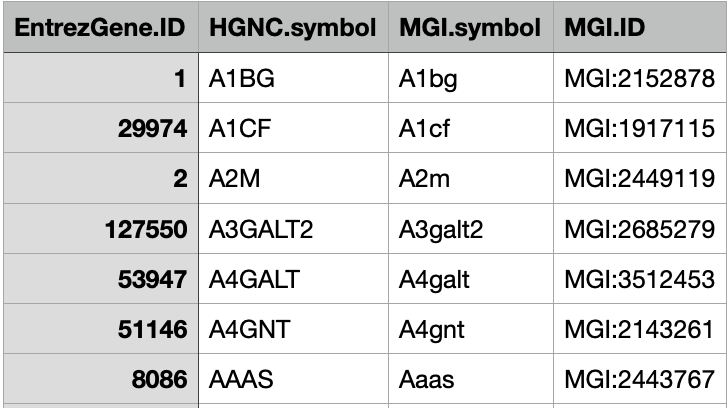

```{r setup, include=FALSE}
```

# COMPASS ALGORITHM

[**Compass**](https://yoseflab.github.io/Compass/user-guide.html) is an algorithm to characterize the metabolic state of cells
based on single-cell RNA-Seq and flux balance analysis (FBA). Its development was motivated by the challenge in characterizing the
metabolic states of single cells on scale with current metabolic assays. Compass is an in silico approach to infer metabolic
status of cells based on transcriptome data, which is readily available even in single cell resolutions.

A detailed description of the algorithm can be found [**here**](https://doi.org/10.1016/j.cell.2021.05.045)

We want to keep our focus first on the algorithm behind all the workflow. This algorithm converts the information about gene
expression of cells into reaction penalties/scores. This is done by using a a Genome-scale Metabolic Model (GSMM) to set a
constraint-based approach.

In the following section we denote:

-   *n*: number of cells (or RNA libraries).

-   *m*: number of metabolic reactions in the GSMM.

-   *C*: the set of cells in the data. (\|C\| = n).

-   *R*: the set of metabolic reactions in the GSMM. (\|R\| = m).

-   *rev(r)*: the reverse unidirectional reaction of reaction r, which has the same stoichiometry but proceeds in the opposite
    direction.

-   *g*: number of genes in a given transcriptome dataset.

-   *S*: the stoichiometric matrix defined in the GSMM, where rows represent metabolites, columns represent reactions, and entries
    are stoichiometric coefficients for the reactions comprising the metabolic network. Reactions for uptake and secretion of a
    metabolite are encoded as having only a coefficient of 1 and -1 in the metabolite's row entry, respectively, and 0 otherwise.

## From gene expression to reaction expression

By reaction expression, we denote a matrix {R(G)}~*mxn*~ that is conceptually similar to the gene expression matrix G~gxn~. The
columns are the same RNA libraries (e.g., cells) as in {G}, but rows represent single metabolic reactions rather than transcripts.
An entry R *r,j* in the matrix R(G) is a quantitative proxy for the activity of reaction r in cell j. We omit the dependence on
gene expression matrix and denote simply R when G is obvious from the context.

As said earlier, the reaction expression matrix is created by using the boolean gene-to-reaction mapping included in the GSMM. Let
G = x~i,j~ and consider a particular reaction r in a particular cell j. If a single gene with linear-scale expression x is
associated with r, then the reaction's expression will be `R r,j = log2(x + 1)`. If no genes are associated with r then R ~*r,j*~
=0. If the reaction is associated with more than one gene, then this association is expressed as a boolean relationship. For
example, two genes which encode different subunits of a reaction's enzyme are associated using an `AND` relationship as both are
required to be expressed for the reaction to be catalysed. Alternately, if multiple enzymes can catalyse a reaction, the genes
involved in each will be associated via an `OR` relationship. For reactions associated with multiple genes in this manner, the
boolean expression is evaluated by taking the sum or the mean of linear-scale expression values *x* when genes are associated via
an OR or AND relationship, respectively.


*Description*: First, we convert the gene expression matrix G~*gxn*~ into a reaction expression matrix R~*mxn*~ which is parallel
to the gene expression matrix, but with rows representing single metabolic reactions rather than transcripts. We convert R into a
**penalty matrix** P~*m x n*~ by point-wise inversion. Whereas [R represents gene expression support that a reaction is functional
in the cell, P represents the lack thereof]{.underline} (which will be used in a linear program below).

The computation of R and P occurs also for the neighbourhood of each cell to smooth results and mitigate single-cell technical
noise. Then, we solve a linear program for every reaction r in every cell i to find the minimal resistance of cell i to carry
maximal flux through r. Last, we scale the scores, which also entails negating them such that that larger scores will represent
larger potential activities (instead of larger penalties, hence smaller potential activity). [The final scores indicative of a
cell's propensity to use a certain reaction]{.underline}. We interpret it as a proxy for the potential activity of the reaction in
that cell.

In step 10 of Algorithm 2, a high penalty y~*r,c*~ indicates that cell c is unlikely, judged by transcriptomic evidence, to use
reaction r. Cells whose transcriptome are overall more aligned with an ability to carry flux through a reaction will be assigned a
lower penalty y~r,c~.

[ space for COMPASS running steps ]

We are not going discuss here how to run the algorithm for now. So let's jump to the post processing steps. The output of COMPASS
is a matrix of penalty scores about the reactions expressions. There are 2 prepared libraries (for python and R languages) to
manipulate data COMPASS outputs and to perform some statistical analysis. We chose to use the R version named compassR

# compassR

The R package [**CompassR**](https://github.com/YosefLab/compassR) provides a specialized pipeline for the analysis and
interpretation of cell-to-cell metabolic heterogeneity based on the single-cell metabolic reaction consistency matrix produced by
the [**COMPASS algorithm**](https://yoseflab.github.io/Compass/index.html). It also includes a suite of expressive utility
functions for conducting statistical analyses building thereupon.

This package creates 2 important instances of its main classes that are **compassData** and **compassAnalyzer**. While the
compassData instance contains many linked information/metadata on our study case, the compassAnalyzer brings in handy statistical
analysis. It was developed by the team of **Nir Yosef**

## CompassData

An instance of this class acts as interface for the following tables:

-   `reaction_consistencies`: each row is a reaction and each column is a cell. So, each coordinate (i, j) indicates the
    consistency or compatibility between reaction i and cell j.

-   `metareaction_consistencies`: Each row is a metareaction and each column is a cell. metareaction_consistencies[i, j] is the
    consistency or compatibility between metareaction i and cell j.

-   `metabolic_genes`: rows describe genes in terms of their ids and whether they are metabolic genes or not.

-   `gene_expression_statistics`:each row describes a cell in terms of its id, total expression, metabolic expression, and
    metabolic activity. A cell's "total expression" is the extent to which it expresses any of its genes. Its "metabolic
    expression" is the extent to which it expresses its metabolic genes. And finally, its "metabolic_activity" is the ratio of its
    metabolic expression to its total expression.

-   `cell_metadata`: the cell metadata from our file cell_metadata.csv.

-   `gene_metadata`: the gene metadata from the metabolic model (RECON2, by default).

-   `metabolite_metadata`: The metabolite metadata from the metabolic model (RECON2, by default)

-   `reaction_metadata`: this is one of the most interesting tibble as it contains mos

-   `reaction_partitions`: each row describes a reaction in terms of its ID, undirected ID (shorthand for the reaction's name),
    direction ("pos" for forward reactions and "neg" for backward reactions), and which metareaction (reaction group) it belongs
    to. A reaction's metareaction ID refers to the ID of the metareaction (group of similar reactions) to which the reaction
    belongs.

## CompassAnalyzer

This class has 2 statistical analysis functions:

-   *Conducting a Wilcoxon test*: to create a table where each row represents a Wilcoxon rank-sum test for whether a reaction or
    metareaction achieves a higher consistency among the group A cells than among the group B cells. It has the following columns.
    In fact, a wilcoxon rank-sum test is a method that determines whether two populations are statistically different from each
    other based on ranks rather than the original values of the measurements. In other words, it ranks all values to determine
    whether the values are or are not evenly distributed across both populations.

-   *Making a UMAP plot*: UMAP is an algorithm for dimension reduction based on manifold learning techniques and ideas from
    topological data analysis. It provides a very general framework for approaching manifold learning and dimension reduction, but
    can also provide specific concrete realizations. The function is based on [**uwot**](https://github.com/jlmelville/uwot)
    package.

## ISSUES

We've encountered some issues in using this package right from the beginning. Let's first list them and then see what approach was
used to solve each one

1.  Starting from the gene_metadata file used to determine various columns in the object. One direct cause was that with their
    version, the cells always had 0 metabolic activity, as if they did not express any metabolic gene.

2.  The conversion of the compass penalties (result of the COMPASS algorithm) into compass scores. First let's say that the
    COMPASS algorithm produces a tsv file named `reactions.tsv` by default and it is a matrix-like file where the rows represent
    single reactions occurring in a generic cell and the columns represent the cells. each coordinate (i, j) indicates the penalty
    for that reaction in that cell, meaning higher is the penalty, less likely is the reaction to occur. And once we start our
    analysis compassR converts these penalties into consistency scores having the opposite meaning of penalties: each row is a
    reaction and each column is a cell. reaction_consistencies[i, j] is the consistency (or "compatibility") between reaction i
    and cell j. We found that the version of the function behind this conversion - `get_reaction_consistencies` - is different
    from the python version of compass analysis that can be found
    [**here**](https://yoseflab.github.io/Compass/notebooks/Demo.html) (at chunk `[10]` )

## FIX

Now to overcome these issues we decided to recreate the library keeping only the essential parts and adapt some operations to the
python version.

### Gene metadata table

The gene_metadata table was recreated using the code below.

```{r eval=FALSE}
# install.packages("babelgene")
# BiocManager::install("org.Hs.eg.db")
# BiocManager::install("org.Mm.eg.db")

library(plyr)
# to find orthologs
library(babelgene)
library("org.Hs.eg.db") # human
library("org.Mm.eg.db") # mouse

x <- org.Hs.eg.db
keytypes(x)
columns(x)
HGNC.ENTREZID <- keys(x, "ENTREZID")
# retrieve human genes metadata
human_genes <- select(x, keys = HGNC.ENTREZID, columns = c("SYMBOL") , keytype = "ENTREZID")
mouse_orthologs <- orthologs(genes = human_genes$SYMBOL, species = "mouse")

y <- org.Mm.eg.db
# retrive mouse genes metadata
mouse_genes <- select(y, keys = mouse_orthologs$symbol, columns = c("MGI") , keytype = "SYMBOL")
mouse_genes_unique <- ddply(.data = mouse_genes, .variables = ~ SYMBOL, .fun = function(x){
    gsub(x[1, 2], pattern = "MGI:MGI:", replacement = "MGI:")
})

# find matching symbols between mouse and human orthologs
ord <- match(mouse_orthologs$symbol, mouse_genes_unique$SYMBOL)

gene_metadata <- mouse_orthologs[, c("human_entrez", "human_symbol", "symbol")]
gene_metadata <- cbind(gene_metadata, mouse_genes_unique$V1[ord])
colnames(gene_metadata) <- c("EntrezGene.ID", "HGNC.symbol", "MGI.symbol", "MGI.ID")
# save on file
write.csv(x = gene_metadata, file = "../gene_metadata.csv", quote = FALSE, row.names = FALSE)

```



In this way the table was recreated with even more rows compared to the one of compassR. The table is recreated using two (2)
Bioconductor packages of genome wide annotation for [**mouse**](10.18129/B9.bioc.org.Mm.eg.db) and
[**human**](10.18129/B9.bioc.org.Hs.eg.db) and one (1) cran package
[**babelgene**](https://cran.rstudio.com/web/packages/babelgene/index.html) to get the gene orthologs for model organisms in a
tidy data format.

### Creation of compass_data

#### Functions

The main problem was on the function `get_reaction_consistencies()` that was largely different between the R and the python
versions. As previously asserted this function converts the outptut of COMPASS algorithm from penalty scores to compatibility
scores.

Let's recall that the penalty function is `p(x) = 1 / (1 + x)`

#### python version:

In the python version we have:


The approach is to:

1.  -log~e~(1+x): negative log to get scores that are higher the more active the reaction is predicted to be
2.  drops reactions that are close to constant and therefore not informative for the comparison.
3.  centre values around the minimum ???

#### R version:


In this case we:

1.  drop inconsistent reactions, i.e. given a default minimum of reaction consistency (note: the original module used the
    reactions penalty scores)
2.  drop constant reactions as they are uninformative
3.  apply negative negative log~2~(x) where x is the penalty score from the COMPASS output
4.  remove the means through columns

Another version of this R version is proposed
[**here**](https://github.com/YosefLab/compassR/pull/9/commits/c39ace83c24bac814ec51a61d830ccc217c9a254). This alternative
solution was not used even though it helped us to figure out that there might be something off with the R version.

After evaluating different approaches to solve this problem we decided to recreate the compass_data object based on the R package
version, but integrating the modifications to get it conformed to the python approach

#### Final solution

```{r collapse=FALSE}

get_reaction_consistencies <- function(reaction_scores, min_range) {
  raw_consistencies <- reaction_scores %>%
    (function(x) { -log(1+x, base = exp(1)) })()
  all_consistencies <- drop_inconsistent_reactions(
                                reaction_consistencies = raw_consistencies,
                                min_consistency = min_range)
  reaction_consistencies <- all_consistencies - min(all_consistencies)
  return(reaction_consistencies)
}
```

Here is our current version of the function and just as the python version:

1.  we apply the negative log to get scores that are higher the more active the reaction is predicted to be
2.  drops reactions that are close to constant and therefore not informative for the comparison.
3.  centre values around the minimum ???

## Example of running my_compassR

#### Settings

We first need to define a some setting parameters that will be used to

```{r eval=FALSE}

settings <- list()
input_path <- "../../../results/eae/tpm_counts/"
metada_path <- "../lib/my_compassR/metadata/"
settings$gene_metadata_path <- paste0(metada_path, "gene_metadata.csv")
settings$metabolite_metadata_path <-  paste0(metada_path, "metabolite_metadata.csv")
settings$reaction_metadata_path <-  paste0(metada_path, "reaction_metadata.csv")
settings$cell_metadata_path <- paste0(input_path, "cell_metadata.csv")
settings$reaction_scores_path <- paste0(input_path, "reactions.tsv")
settings$gene_expression_path <-paste0(input_path, "linear_gene_expression_matrix.tsv")
settings$min_reaction_consistency <- 1e-10 # still to be defined but I'd prefer keeping it to the minimum possible
settings$min_reaction_range <- 1e-3  # taken from Python version
settings$reaction_direction_separator <- "_"
settings$reaction_directions <- c("neg", "pos")
settings$cluster_strength <- 0.1  # taken from compassR
settings$gene_id_col_name <- "HGNC.symbol"
settings$cell_id_col_name = "cell_id"

```

All the parameters in the top block depends on where the input files are on the PC as they just indicate the paths. Let's focus on
those in the lower block:

-   `min_reaction_consistency`: still to be defined but I'd prefer keeping it to the minimum possible

-   `min_reaction_range`: Reactions are dropped if they have a range of consistency scores narrower than this threshold. (taken
    from Python version)

-   `reaction_direction_separator` & `reaction_directions`: It is assumed that reaction IDs take the form
    *{uniqueid}{separator}{one of N annotations}*, where the annotations are specified by this length-N character vector,
    interpreted as regular expressions. Reaction directions: "pos" for forward reactions and "neg" for backward reactions

-   `cluster_strength`: A number between 0 and 1, specifying the aggressiveness with which to cluster similar reactions together
    into metareactions. (not used for now, taken from compassR)

-   `gene_id_col_name`: The name of the column that uniquely identifies each gene in the gene metadata file.

-   `cell_id_col_name`: name of the column that uniquely identifies each cell in the cell metadata file. Here are the steps to
    build a compass_data object:

1.  read the genes, metabolite, and reaction metadata tables that are always the same for any analysis.
2.  read the file inputs that are cell metadata (of our analysis set), reaction scores (output of the COMPASS analysis processing
    which are penalties), gene expression file (input of the COMPASS analysis processing).
3.  calculate reaction consistencies: it consists in converting penalty scores in compatibility scores.
4.  create metabolic gene table: where each row says whether or not the gene is metabolic.
5.  get the statistics about the gene expressions.

And all these tables are then put together to create our compass_data object.

```{r eval=FALSE}

build_my_compass_data <- function(settings) {
  gene_metadata <- read_compass_metadata(settings$gene_metadata_path)
  metabolite_metadata <- read_compass_metadata(settings$metabolite_metadata_path)
  reaction_metadata <- read_compass_metadata(settings$reaction_metadata_path)
  cell_metadata <- read_compass_metadata(settings$cell_metadata_path)
  reaction_scores <- read_compass_matrix(settings$reaction_scores_path, "reaction_id", suppress_warnings = TRUE)
  linear_gene_expression <- read_compass_matrix(settings$gene_expression_path, "gene")
  reaction_consistencies <- get_reaction_consistencies(
    reaction_scores,
    min_range = settings$min_reaction_range
  )
  # annotated_reactions <- get_annotations(
  #   rownames(reaction_consistencies),
  #   separator = settings$reaction_direction_separator,
  #   annotations = settings$reaction_directions,
  #   id_col_name = "reaction_id",
  #   unannotated_col_name = "reaction_no_direction",
  #   annotation_col_name = "direction"
  # )
  # metareactions <- get_metareactions(
  #   reaction_consistencies,
  #   cluster_strength = settings$cluster_strength
  # )
  # metareaction_consistencies <- get_metareaction_consistencies(
  #   reaction_consistencies,
  #   metareactions
  # )
  # reaction_partitions <-
  #   annotated_reactions %>%
  #   dplyr::left_join(
  #     metareactions,
  #     by = "reaction_id"
  #   )
  metabolic_genes <-
    tibble::tibble(gene = rownames(linear_gene_expression)) %>%
    dplyr::left_join(
      tibble::tibble(
        gene = gene_metadata[[settings$gene_id_col_name]],
        is_metabolic = TRUE
      ),
      by = "gene"
    ) %>%
    tidyr::replace_na(list(
      is_metabolic = FALSE
    ))
  gene_expression_statistics <- get_gene_expression_statistics(
    linear_gene_expression,
    metabolic_genes
  )
  compass_data <- list()
  compass_data$settings <- settings
  compass_data$reaction_consistencies <- reaction_consistencies
  # compass_data$metareaction_consistencies <- metareaction_consistencies
  compass_data$metabolic_genes <- metabolic_genes
  compass_data$gene_expression_statistics <- gene_expression_statistics
  compass_data$cell_metadata <- cell_metadata
  compass_data$gene_metadata <- gene_metadata
  compass_data$metabolite_metadata <- metabolite_metadata
  compass_data$reaction_metadata <- reaction_metadata
  # compass_data$reaction_partitions <- reaction_partitions
  return(compass_data)
}

```
